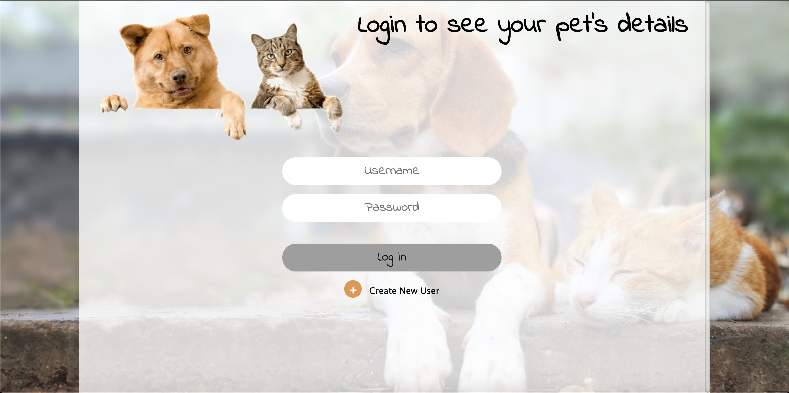
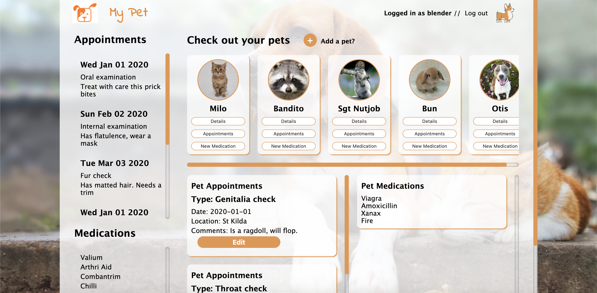

<h1>GA Software Engineering Immersive - Group Project 3</h1>

<h2>:dog:App: MyPet:rabbit:</h2>

Intro:
Team project requirement is to build an interactive web application which included both client-side and server-side functionality that was been built with JavaScript and Node.js

:key:Features:
  - User login
  - Interactive dashboard 
  - Create pets and edit pet details on dashboard
  - Create new appointments and medications for each pet
  - View all appointments and medications for all pets
  - View all appointments and medications for selected pet
  
:rocket:Challenges:
  - Enabling user sessions on node.js
  - Having multiple team members work on the backend server file at one time
  - Using github branches locally to work on the remote repository

:computer:Developers: Jeremy, Ben, Mirko, Matt

Link to project: https://ga-mypet.herokuapp.com/

Link to wireframes, databases: https://whimsical.com/embed/DnWiRTPrYfRX1WdyVZqgcN
